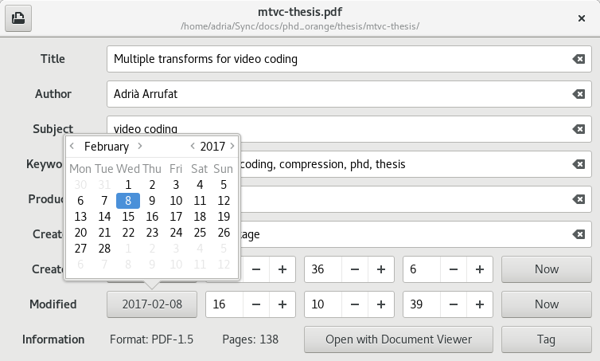

# Pdftag
A simple metadata editor for PDFs



## Introduction

The main goal of Pdftag is to provide a simple and usable solution to edit metadata found in PDFs.

Other more complex solutions exist to manipulate PDFs, but they may have dependencies on Java and may be not completely free.

This project makes use of the [poppler] library for all the PDF information reading and writing.

It is written in [Vala] and [GTK+], meaning it is fast and has a small memory footprint.

## Features

Pdftag supports editing the following PDF tags:

- Title
- Author
- Subject
- Keywords
- Producer
- Creator
- Creation date
- Modification date

It also displays useful non-editable information:

- PDF format
- Number of pages

## Compiling and installing

To build Pdftag you need the following dependencies (including development files):

- meson (build only)
- ninja (build only)
- vala (build only)
- gtk3
- poppler-glib

Then run

```
meson --prefix=/usr/local (or your preferred installation prefix)
ninja -C build
ninja -C build install
```

[poppler]:https://poppler.freedesktop.org/
[Vala]:https://wiki.gnome.org/Projects/Vala/
[GTK+]:https://www.gtk.org/
